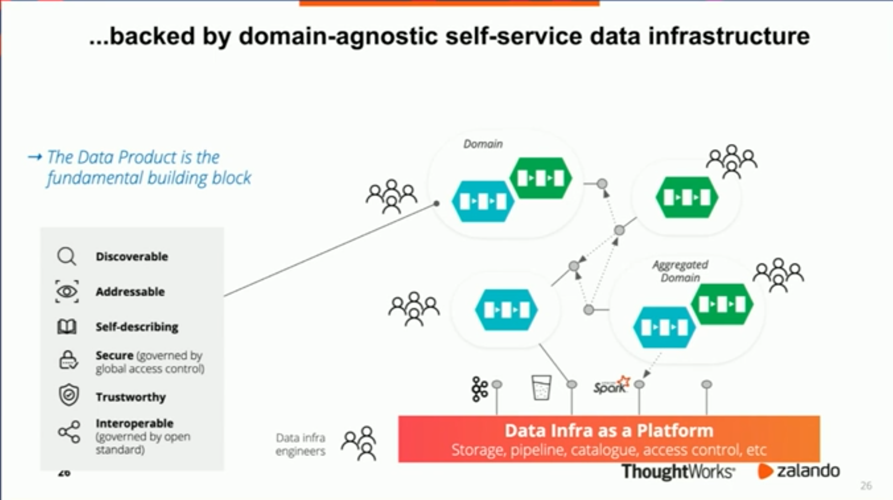

# Data Mesh
Centralized data team becomes a bottle neck.

Like micro service achitecture, move to domain-driven distributed architecture.
Each domain has a data product and have data infra as a platform. 

The data infra platform should be domain agnostic. If you have to know some domain knowledge to solve data infra platform, you are going back to monolith.

source: (Data Mesh in PracticeL How Europe's Leading Online Platfrom for Fashion Goes Beyond the Data Lake - Max Schultze, Arif Wider)

More detailed info here (https://martinfowler.com/articles/data-monolith-to-mesh.html)