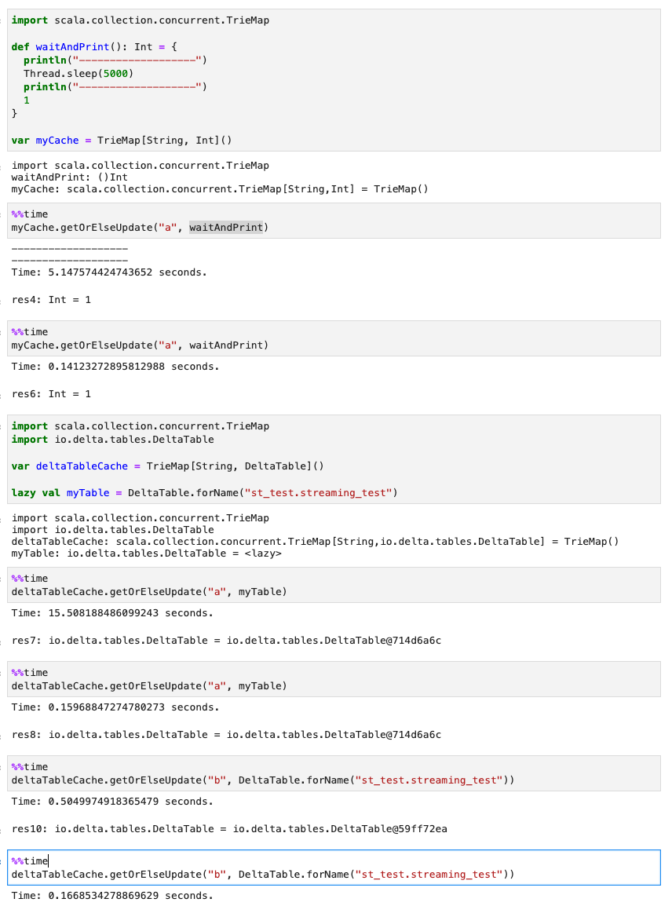

# Local Cache in Scala

Today I wrote a Spark streaming ETL job in Scala and had to use a local cache which contained `io.delta.tables.DeltaTable` objects. First thing came to my mind was `scala.collection.mutable.map[String, DeltaTable]`. However, folks in StackOverflow recommended to use `scala.collection.concurrent.TrieMap` instead for better thread-safety and etcetera. So I followed their sage advice and used `TrieMap`. 

`TrieMap` implements `getOrElseUpdate` method. It is self-explanatory, but here is the code.

```scala
  /** If the specified key is not already in the map, computes its value using
   *  the given thunk `op` and enters it into the map.
   *
   *  Since concurrent maps cannot contain `null` for keys or values,
   *  a `NullPointerException` is thrown if the thunk `op`
   *  returns `null`.
   *
   *  If the specified mapping function throws an exception,
   *  that exception is rethrown.
   *
   *  Note: This method will invoke op at most once.
   *  However, `op` may be invoked without the result being added to the map if
   *  a concurrent process is also trying to add a value corresponding to the
   *  same key `k`.
   *
   *  @param k      the key to modify
   *  @param op     the expression that computes the value
   *  @return       the newly added value
   */
  override def getOrElseUpdate(k: K, op: =>V): V = {
    val oldv = lookup(k)
    if (oldv != null) oldv.asInstanceOf[V]
    else {
      val v = op
      if (v == null) {
        throw new NullPointerException("Concurrent TrieMap values cannot be null.")
      } else {
        val hc = computeHash(k)
        insertifhc(k, hc, v, INode.KEY_ABSENT) match {
          case Some(oldv) => oldv
          case None => v
        }
      }
    }
  }
```

As you can see, `op` only gets evaluated when `k` does not exist. However, I wasn't sure if the lazy evaluation would work with the following code.

```scala
import scala.collection.concurrent.TrieMap
import io.delta.tables.DeltaTable

var deltaTableCache = TrieMap[String, DeltaTable]()

/*
> SHOW TABLES IN st_test;
+--------+--------------+-----------+
|database|     tableName|isTemporary|
+--------+--------------+-----------+
| st_test|streaming_test|      false|
+--------+--------------+-----------+
*/

deltaTableCache.getOrElseUpdate("a", DeltaTable.forName("st_test.streaming_test"))
```

(`DeltaTable.forName("st_test.streaming_test")` takes about 15 seconds when it is called.)

---

Results are down below. To summarize, `getOrElseUpdate`'s lazy functionality does work great. However, this was unneccesasry because `DeltaTable.forName` already cache's `DeltaTable` in memory. 🤷‍♂️

