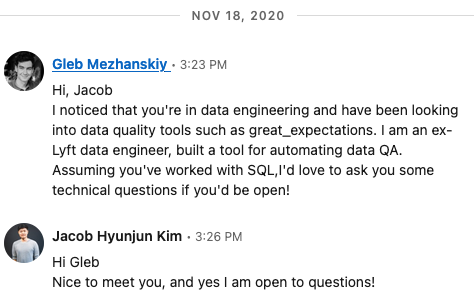

# Startups Trends 2021?

## YCombinator
Summary (S20 batch)
| Industry                     | Count |
| ---------------------------- | ----- |
| B2B Software and Services    | 91 |
| Consumer                     | 24 |
| Education                    | 9 |
| Healthcare                   | 26|
| Real Estate and Construction | 6|
| Financial Technology         | 21|
| Industrials                  | 5|
| Government                   | 2|

### B2B SaaS

#### API Stuff

**[finch](https://www.ycombinator.com/companies/22272)**
> The universal payroll and HR API
Finch allows applications to access data and make changes across payroll and HR systems through a single API.

HR API

**[Speedscale](https://www.ycombinator.com/companies/21883)**
> Accelerate development by simulating API's with production traffic.

Problems they are solving: 
- MSA testing sucks
- Kubernetes testing is hard

**[Metamanagement](https://www.ycombinator.com/companies/21733)**
> We help SaaS companies deploy into their customer's environment.

Problem: 
Solution: Help MSA testing suck less

#### Data Engineering
Apparently, data QA & metadata management has some market.
- https://www.dataengineeringpodcast.com/bigeye-data-quality-market-episode-160/
- https://stemma.ai/

**[Hubble](https://www.ycombinator.com/companies/21782)**
> Automated testing and monitoring of data metrics

Problems they are solving:
- Data quality issues are hard

Open source alternatives:
- [greate_expectations](https://github.com/great-expectations/great_expectations)

**[Datafold](https://www.ycombinator.com/companies/21781)**
> Datafold is a data observability platform that helps Data teams move faster and with higher confidence by automating data quality analysis, monitoring, and common repetitive tasks in data engineering workflow.

Problems they are solving:
- Automating Data QA

Open source alternatives:
- [greate_expectations](https://github.com/great-expectations/great_expectations)

MISC:
- Aggresive LinkedIn marketing

**[Mozart Data](https://www.ycombinator.com/companies/22248)**
> The easiest way to set up a modern data stack

Problems they are solving:
- Building data pipelines? (Not sure what they do)

**[Jitsu](https://www.ycombinator.com/companies/19932)**
> Open-source data integration and event collection platform.

https://github.com/jitsucom/eventnative

Problems they are solving:
- Building data pipelines? (Not sure what they do)

**[airbyte](https://www.ycombinator.com/companies/13549)**
> Open-source EL(T) platform

https://github.com/airbytehq/airbyte

Problems they are solving:
- Building data pipelines

...