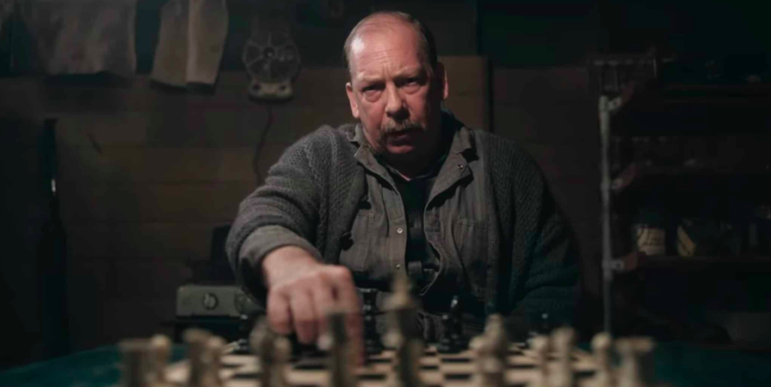
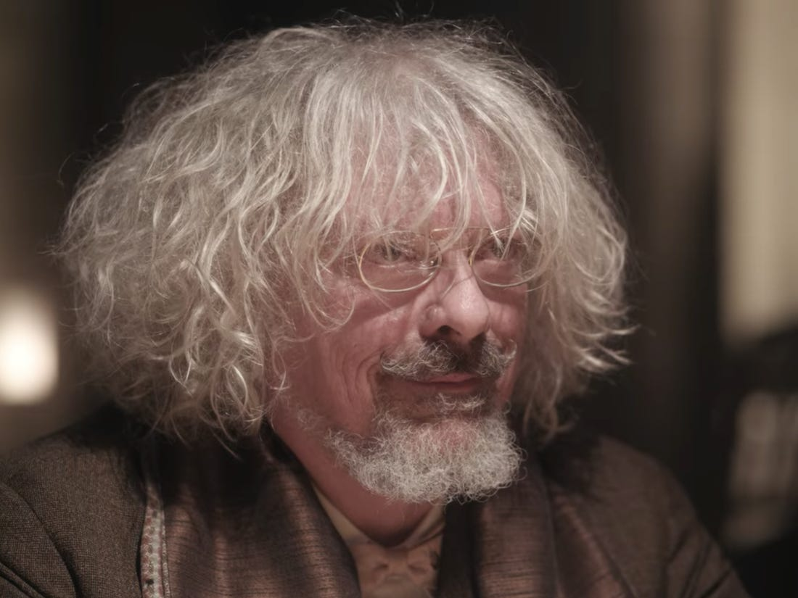
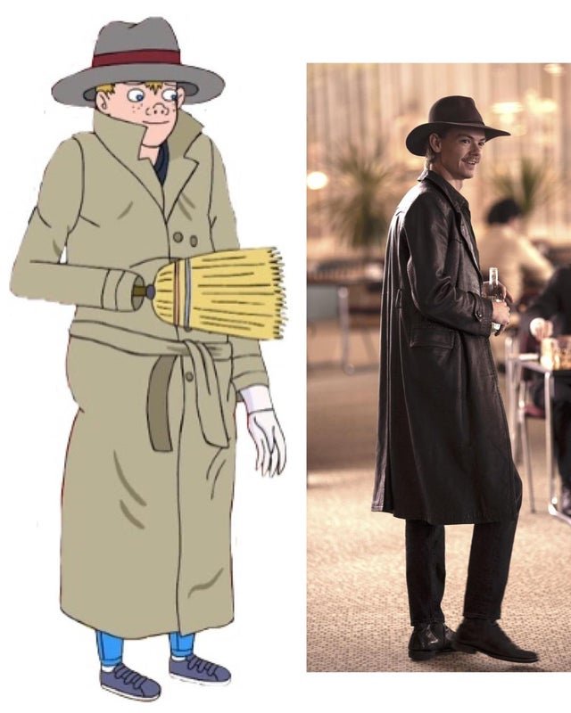

# The Queen's Gambit

Fuck. I just ugly sobbed in the last epside of _The Queen's Gambit_. What an amazing show. The story, characters, pictures, colors, filming, acting just astounding. Since this show was so amazing, I would like to write few words about my review and feelings towards _The Queen's Gambit_.

---
## Inner Demon
Beth, growing up as an orphan her only escape is to play chess in the basement with Mr.Shaibel, a janitor. It turns out she is gifted at playing chess and later on she becomes the chess world champion. Even though this show is centered around chess, it is not at all about chess. To quote Scott Frank, the writer of the show,

> It’s not about a game, it’s about the cost of genius.[1]

Beth becomes addicted to tranquilizers when she was only nine years old. She discovers alcohol when she was like 15 or 16, and smokes cigarettes soon after. She goes to the Paris chess finals hungover and loses because of that! Some shows are focused on the “Will They or Won’t They” relationship. Instead, The Queens Gambit focuses on, “Will she go crazy and destroy herself or Not?” Even when Beth was young, Mr. Shaibel warned about her genius. The reporter from the local magazine says something along the line of “genius often comes madness.” Harry Beltik gives Beth a book about Morphy, a legendary chess player who retired at 21 and died early. “The pride and the sorrow of chess is gone forever.” And many more warnings about Beth’s future throughout the entire show. The plot around one’s gift and self-destructiveness was refreshing and nice, to say the least. I don’t know exactly how to describe it but it was good. I wish I was more articulate about expressing my feeling towards this.
Anyway, Beth somewhat reminded me of BoJack Horseman. Obviously, Beth is not a total trainwreck like BoJack, but they share some similarities like the loneliness, abusive parents, unpleasant childhood, fame, drugs, and alcohol. Unlike BoJack, Beth overcomes her issues and addiction. When she flushed her sedatives down the toilet in Moscow, I was so happy for her.

On a side note, I don’t know why I enjoy plots about one’s utter self-destruction, like BoJack Horseman and The Queen’s Gambit. I don’t know how I empathize with them even though I’ve never had such experience nor the desire to do so. I guess I have some inner demons that I am don’t know much about. It might wreck me when I am older. I am excited to find out.

### Mr.Shaibel
WHY DIDN’T BETH VISIT MR.SHAIBEL NOR GAVE HIM HIS $10. JESUS CHRIST BETH!

Mr. Shaibel was a good man. He taught Beth how to play chess, sportsmanship, gave her connections, and that precious $5 which launched her career as a professional chess player. He was the only father figure she had. I got emotional when Beth finds out about Mr.Shaibel’s newspaper and magazine clipping about her. Why did she never visit him? Maybe because Beth doesn’t see herself as worthy enough of the love or the fame she got. I am unsure. I would have been so happy if she did visit Mr.Shaibel when he was alive. But damn. 

This reminds me to visit people who helped me in my life.

### Men in The Queens Gambit

    
    

Speaking of Mr.Shaibel, men in The Queen’s Gambit are good. I was afraid that Beth might be abused by her stepfather or get some sort of sexual harassment in the male-dominated Chess scene. But none of those happened and that was nice. Borgov, the Soviet world champion, was a good sport about him losing the championship title to Beth. Luchenko, another Soviet chess player, was such a nice person as well! Benny, Beltik, Townes, the twins, even the grumpy cashier at Lexington, Kentucky knew she was stealing the chess magazine when she was young but he allowed it. But fuck Mr.Wheatley, what an asshole.

### Gender
Beth is a phenomenal portrayal of a female protagonist. The classic archetype of a smart female character seems to be someone who is super nerdy, does not care about the real world, anti-social, etc. Beth, on the other hand, fully embraces her feminine side. She likes finer things like fashion, hairstyle, and of course Gibson on the rock with pickled onion. That scene where she gets her skin and nail done at Houston with Mrs.Wheatley was wholesome. Showing mother and daughter's relationship.

Relating to Beth's fashion, the costumes! The costumes are so well picked, dresses, suits, and set designs are freaking fabulous. At the end of the show, her white coat and the hat resembles the queen piece from chess.

## Photography
I am by no means an expert in films or photography. But here are a few things I've noticed and loved.

### Split diopter shot

Split diopter shot[2] contiains two focal points in a same shot. In the particular shot above, it is used to portray Beth's uneasiness and fear she has for Borgov. Pretty styilsh.

---
Benny == Vicent Adultman 🤔🤔🤔

    
    [3]

This guy Thomas Brodie-Sangster, does not age! I saw him in _Love Actually_ , _Game of Thrones_, _The Maze Runner_ and many more, and he always look like a kid. Amazing actor, but I couldn't giggle whenever he came on screen. This time he even has a cool mustache with a knife. 😂

---
### Sources:
[1] [Creating The Queen’s Gambit | Netflix](https://youtu.be/LzDhpEInMIg)  
[2] Thanks to NerdWriter1's ["The Real Facke Cameras of Toy Story 4"](https://youtu.be/AcZ2OY5-TeM)  
[3] [just_me_or](https://www.reddit.com/r/queensgambit/comments/jtuys6/just_me_or/)